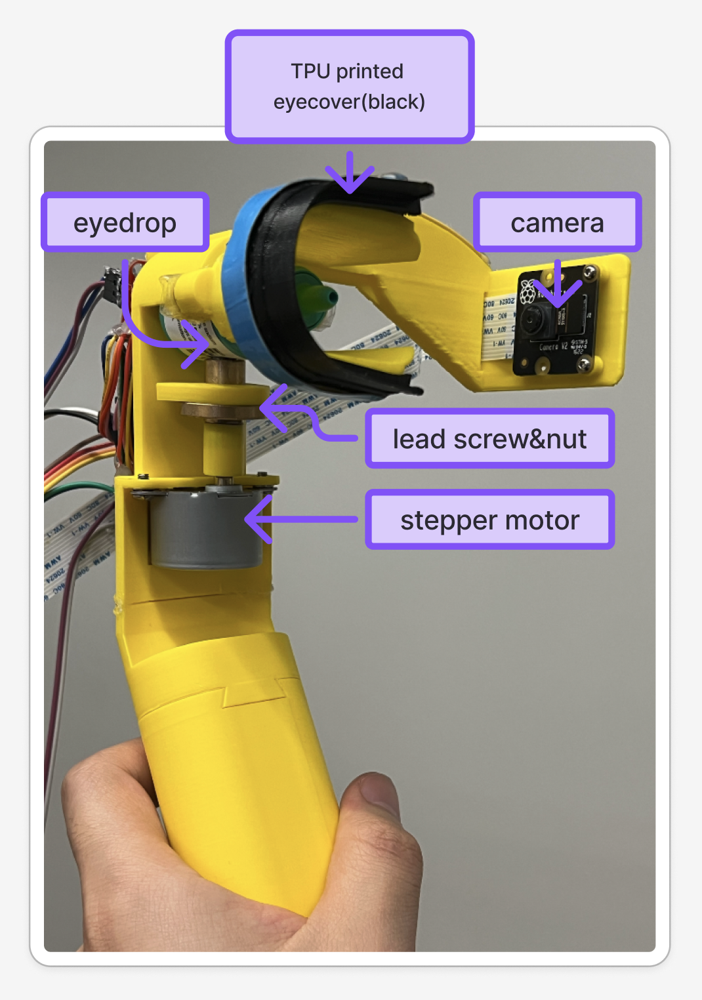
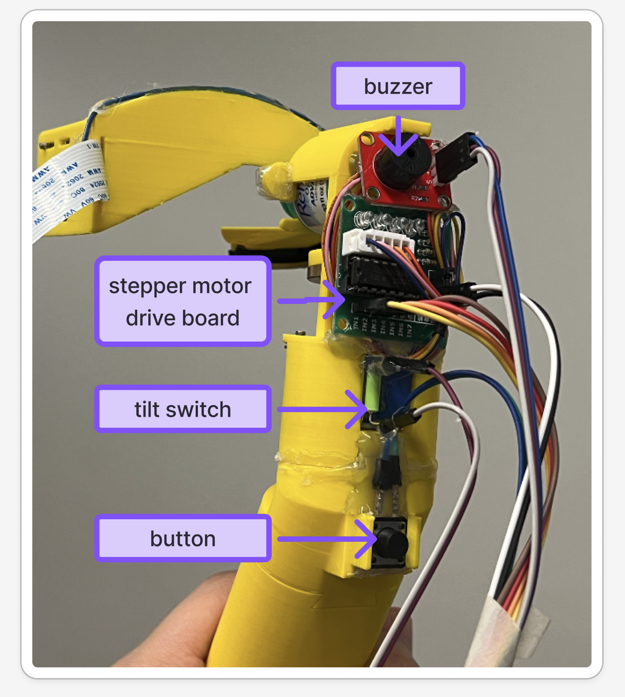
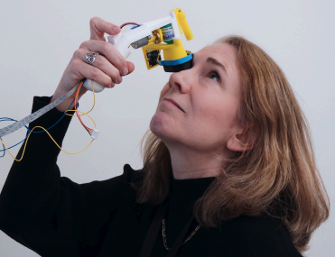

# How to replicate the hardware prototype 

## Bill of Materials (BOM)

| name | link | count | price (USD) | notes |
|------|------|------|-----------|------|
| main body | [main body stl file](./3d%20print/main_body.stl) | 1 | - | - |
| eye cover | [eye cover stl file](./3d%20print/eye_cover.stl) | 1 | - | - |
| buzzer breakout board | [ebay link](https://www.ebay.com/itm/305955752072?chn=ps&mkevt=1&mkcid=28&google_free_listing_action=view_item&srsltid=AfmBOooTWdsfTm2qaCUZ0KN5gp1MGYCG-ywpCDCLxHKUqmNwkQ4iUdZ5WcI&gQT=1) | 1 | 5 | I couldn't find an identical one with the one we are currently using, but they all have same functions, size might be different though (might need to tune the nut hole position on the model) |
| ULN2003 28BYJ-48 4-Phase Stepper Motor with 5V Drive Board  | [amazon link](https://www.amazon.com/HiLetgo-ULN2003-28BYJ-48-Stepper-4-phase/dp/B00LPK0E5A/ref=sr_1_2_sspa?crid=1XHCUUF2E3X4M&dib=eyJ2IjoiMSJ9.Qa3CQUjLdgK6uEHpJhtsnI4ELhK7aHAmd-Ei-JAIRqwDcgL3MP0jscRJUTv3cKjKcBRCnk-Q7GVspk43Qe8rUQP2nwb3NTHoLz0R-nqRW-dbdu9dGK0bBUo0jIVyk2WR-lCtgC1KOEy-v6HLVw3tZP6WZ8c8Hh8UiAngDsl0kx1G1Oz0HuT1gkcUJOwoWInF0Qb-iBOIGM-bPVyV-Yh9MbHfmroCl83ngP7WWGdxIuc.V_qLAbR4rCg8FhxQB-BSsO2m62YArM6y9rSkkS14W18&dib_tag=se&keywords=stepper+motor&qid=1742525372&sprefix=stepper%2Caps%2C182&sr=8-2-spons&sp_csd=d2lkZ2V0TmFtZT1zcF9hdGY&psc=1) | 1 | 3/ea | - |
| button | [amazon link](https://www.amazon.com/Momentary-Pushbutton-Switches-Breadboard-Electronic/dp/B09R47N37H/ref=sr_1_2_sspa?crid=2PVUKEP7O3VC2&dib=eyJ2IjoiMSJ9.ndHYGnPty7Kigws1fmGVdS7mRoukyXE7d63GLZ_hPPK9dLiNlTwhgF_sj0441s5w8vsBjXUk48myqWxTyRJQZ048o0_GD2XIvtkC0UBQiazjGazZajKKhCmDU06U0MY5EPsAjLWrm_g3YfDlUAfDWL1_BALPKwt-_CScsWKJ-VUsRrbseiKehKE0JtI_NkxAVQva4WXRqfK-mgPPKOnRskIaA97SVGRYqYHc5EPSDt8.IlHTbI8hQGxLWxUMJ-KIS1Y57kifym9cBPhJpIPpoq4&dib_tag=se&keywords=button+arduino&qid=1742525424&sprefix=button+arduin%2Caps%2C254&sr=8-2-spons&sp_csd=d2lkZ2V0TmFtZT1zcF9hdGY&psc=1) | 1 | 0.05/ea | - |
| 2mm pitch lead screw & nut | [amazon link](https://www.amazon.com/400mm%EF%BC%8815-75-Inches%EF%BC%89Tr8x2-Thread-Printer-Machine/dp/B08JLWHG9H/ref=sr_1_2_sspa?crid=204RM7BHWRJDU&dib=eyJ2IjoiMSJ9.eCMHWpjfsRVtDdcYgs-M-BNH6PpmcOsWporfgeZVTfzGjHj071QN20LucGBJIEps.0hwz7vzlM7jpEtuQBS2sCe4ikMdKQQbqaFn-zhjBUyg&dib_tag=se&keywords=2mm%2Bpitch%2Blead%2Bsc&qid=1742525536&sprefix=2mm%2Bpitch%2Blead%2Bsc%2Caps%2C358&sr=8-2-spons&sp_csd=d2lkZ2V0TmFtZT1zcF9hdGY&th=1) | 7.5/ea | 1 | cut the lead screw to about 2mm in length |
| LED strip | [amazon link](https://www.amazon.com/PAUTIX-Dimmable-Backlight-Flexible-Lighting/dp/B0B1J57XS9/ref=sxin_16_pa_sp_search_thematic_sspa?content-id=amzn1.sym.9ae96427-feac-4323-af17-06872169e170%3Aamzn1.sym.9ae96427-feac-4323-af17-06872169e170&crid=3636KKS2ZFGPG&cv_ct_cx=led%2Bstripe&keywords=led%2Bstripe&pd_rd_i=B0CMSW9CLB&pd_rd_r=f08adace-8df2-4b1c-a126-9ee66ef9e448&pd_rd_w=DWOXe&pd_rd_wg=lcmzB&pf_rd_p=9ae96427-feac-4323-af17-06872169e170&pf_rd_r=QQ8V7F31ANWMCMHZ00FK&qid=1742525622&sbo=RZvfv%2F%2FHxDF%2BO5021pAnSA%3D%3D&sprefix=led%2Bstrip%2Caps%2C168&sr=1-2-e169343e-09af-4d41-85b1-8335fe8f32d0-spons&sp_csd=d2lkZ2V0TmFtZT1zcF9zZWFyY2hfdGhlbWF0aWM&th=1) | 14 | 1 | cut the strip to about 80mm long |
| battery box | [amazon link](https://www.amazon.com/Goweewon-AA-Battery-Holder-Leads/dp/B0CWFCPNRT/ref=sr_1_1_sspa?crid=1BZVWJBU2P0O2&dib=eyJ2IjoiMSJ9.lPPObmwoituHQda3Go8YDFV8ebSSTyZxt66x-IetRj_hKv14Mnir7D-SfcK-wCoWtLUmV6zvzdw5PuHcHJaY7MemG5b2BceWZ9UIweKUhf32ZWgmLkdKqdtDxQIeu-vlzh7K4wiMqztejkwGbNzGfzw3psh4TJhmev0YHCil9VHlyvsPq2FWLtYwCZ174DDn7JDUrAo0xSAeMPqTaIWuUhKquB9LYulQ8k4IOMf3A8Y.FzgQ_xxLh6hHwV1t9o3UPgbwFwJuESdmFnRjs8NJuQs&dib_tag=se&keywords=battery%2Bbox%2BAA%2B3%2Bslot&qid=1742525910&sprefix=battery%2Bbox%2Baa%2B3%2Bslot%2Caps%2C146&sr=8-1-spons&sp_csd=d2lkZ2V0TmFtZT1zcF9hdGY&th=1) | 8 | 1 | for powering the LED strip (which should run under 5V), this battery box provides 4.5V, but still sufficient to light up the LED |
| 9v battery connector | [amazon link](https://www.amazon.com/Battery-Connector-Plastic-Experiment-Equipment/dp/B08SL9X2YC/ref=sr_1_2?crid=1GCFFCX99NKSW&dib=eyJ2IjoiMSJ9.cPyl9XTIX6B9MfgCRRpDEscYkyho57s4B7exQhpIL-wI_QNpAo54rJSOgmafsjfW_Ptu-K4pbwMHh_RQRAcoM-qAH1VsWwa5F2jPNfGELzU94uKM4MY-qSdgPqUV7puHugXNUwtQ1OY0gwNrjQkRP2ly-SyBEw27NWmWeYhdyz8YrocmLrzZtNvaezwpyE_kb14BB1pTysETQUgGfqA-QXR0EVs7DLFyquBVsagrAkE.kGZOCUJ6Tx3glwoQO8jcU-lht6wefbUxfDBtPC57_jA&dib_tag=se&keywords=9v%2Bbattery%2Bcap&qid=1742528843&sprefix=9v%2Bbattery%2Bc%2Caps%2C278&sr=8-2&th=1) | 0.5/ea | 1 | for connect to 9v battery and power the stepper motor drive board |
| toggle switch | [amazon link](https://www.amazon.com/HiLetgo-AC125V-Terminals-Position-Toggle/dp/B079JBF815/ref=sxin_17_pa_sp_search_thematic_sspa?content-id=amzn1.sym.9ae96427-feac-4323-af17-06872169e170%3Aamzn1.sym.9ae96427-feac-4323-af17-06872169e170&crid=1HUDVM364L41R&cv_ct_cx=toggle+switch&keywords=toggle+switch&pd_rd_i=B079JBF815&pd_rd_r=8f64b633-7c90-412f-becf-72ffd5faf14f&pd_rd_w=5qhhp&pd_rd_wg=kfm2i&pf_rd_p=9ae96427-feac-4323-af17-06872169e170&pf_rd_r=ZC2FM8ZFB2CQ5SD7E86Z&qid=1742528935&sbo=RZvfv%2F%2FHxDF%2BO5021pAnSA%3D%3D&sprefix=toggle+switch%2Caps%2C193&sr=1-4-e169343e-09af-4d41-85b1-8335fe8f32d0-spons&sp_csd=d2lkZ2V0TmFtZT1zcF9zZWFyY2hfdGhlbWF0aWM&psc=1) | 0.6 | 1 | toggle whether the 9v battery is connected to the stepper motor drive board |
| Raspberry Pi Camera Module V2-8 Megapixel | [amazon link](https://www.amazon.com/Raspberry-Pi-Camera-Module-Megapixel/dp/B01ER2SKFS/ref=sr_1_3?dib=eyJ2IjoiMSJ9.SdZxeeuAaWgC9GeoeEJUFP62foW2SztM96rrEg7VSsYD-p1fQE48UWVjERlWaOfWzhD-QO70AYkKt6meJD3UZqbjvM337zp8JJ6E8cCavg-oFdH4X9n6Cc0zgie6v2GYe3G624QvkwQyoZj3dIts3Fc4AASXSf19Jx852MXh_J98LPWiijeyERAfjZTtMTasm-vw5YwcjXoSd08cym7TBl4mqm_aLJgTqAVmBJaZ7Xg.3ECh9_-607HgW_VnJy7emLPYlaDEs5zsGDzYKBbPsto&dib_tag=se&keywords=raspberry+pi+camera&qid=1742529031&sr=8-3) | 13 | 1 | - |
| Raspberry Pi 4B | [amazon link](https://www.amazon.com/Raspberry-Model-2019-Quad-Bluetooth/dp/B07TC2BK1X/ref=sr_1_1?crid=1YITJHF9OCVYQ&dib=eyJ2IjoiMSJ9.HavuMzOx0pibLLpdWCmY00k6Sz1h7IjNXYchbCG7xmeterViSIylhvpNrT0tJWntAAZEUi1P3KQ2hMqRN-N16KH3eKSnNiwrf_Aae9l2NKCRTKlflgkhkYDdPe46vN3sP5cyneKBqcfOM0E_Xj3jhQTZ-OXSbg2ufINEuSbhWTwDLKidwPub9YLdA_p0K_DCgFsNITO8G_auXlTd4idIkvWbkBjNhewNp05Cuu8sWQM.rv6nShqwJBonCcP8Fnxt4ksp6jPn3jQPqRsCoRnEDFM&dib_tag=se&keywords=raspberry%2Bpi%2B4b&qid=1742529069&sprefix=raspberry%2Bpi%2B4%2Caps%2C312&sr=8-1&th=1) | 62 | 1 | - |
| Refresh Optive Advanced Eye Drops | [amazon link](https://www.amazon.com/Refresh-Optive-Advanced-Fluid-Ounce/dp/B00B6A6VFQ/ref=sr_1_5_sspa?crid=7ERC7EVXXWKJ&dib=eyJ2IjoiMSJ9.qTPlK5IAgLBEWNLgtoHNdzhDvRqCOJkCKJrL3bf_h0xcisQixgUrKDPuMVApe4HTqO_JldvpJq1fVso6dUAFhEOxAfksLIddEE_4GHl6UMaoY-DZp1IXFQAtzvPaz64osiQBRxVo0ng5Pmq3PItP3Y8OvjsA-MsQMrnIH7Ka5YwmobsPoc6AfNDXd9DPhmphNonJ8fAS1HmKC8C42gbgxUxyUALSHOtz99r_RsnOsMjRJCqlNoB4jukNvIUZJjdUbYGaTj-JPnDY74fr5uCdHggc4wQm-qd4ilJtiwszkoY.2t2YM7Hj7KLM5Sm8xaArdgFA96zQGDwFfv3uAjP7w78&dib_tag=se&keywords=eyedrop&qid=1742529148&rdc=1&sprefix=eyedrop%2Caps%2C244&sr=8-5-spons&sp_csd=d2lkZ2V0TmFtZT1zcF9hdGY&psc=1) | 10/ea | 1 | - |

## Assemble

1. The stepper motor is fixed to the main body with M3 nut and screw.
2. The lead screw nut is bound with a tab, then connected with the rod of the stepper motor with a 3d printed adaptor. The lead screw nut should be placed against the eyedrop bottle.
3. Place the eyedrop bottle into the slot of the main body.
4. On the eyecover side, attach the TPU-printed eyecover (friction fit) and the camera module (connected with M3 screw and nut). Then the eyecover should be able to be snap fit to the neck of the eyedrop bottle.
5. Attach 7mm diameter magnet to both the main body and the eyecover. This allows the eyecover to rotate 180deg and fix into the right position leveraging magnet attraction. 

1. Buzzer module, motor drive board module, and button are all hot glued onto the device. (In our new fusion design, they can attach to the device using M3 nuts and screws.)
2. Buzzer module connection to Rasp Pi: `signal -> GPIO23`, `Vcc -> 3V3`, `GND->GND`
3. Motor driver module connection to Rasp Pi: `IN1 -> GPIO17`, `IN2 -> GPIO18`, `IN3 -> GPIO27`, `IN4 -> GPIO22`. 9V and GND of the driver board is connected to the 9V battery connector (with the toggle switch connected in serial).
4. Button connection to the Rasp Pi: `Button Pin1 -> GPIO4`, `Button Pin2 -> GND`.

# How to use the prototype

1. After full assembly, clone the python code from https://github.com/accessible-eyedrop/accessible-eyedrop-RaspPi to the Rasp Pi, follow the instruction in the repo to run the code on the Pi.
2. Toggle on the LED strip and stepper motor power supply.
3. Place the device over your eye, tilt your head backwards.

4. Push the button, the device should dispense one drop, and the Python backend will tell you whether it is a successful administration or not. If you also run our front-end code https://github.com/accessible-eyedrop/accessible-eyedrop-Frontend, the data can be shown on the front-end.

HOW-TO-USE video [demo1](./video/dispense.mp4) and [demo2](./video/workflow.mp4).
